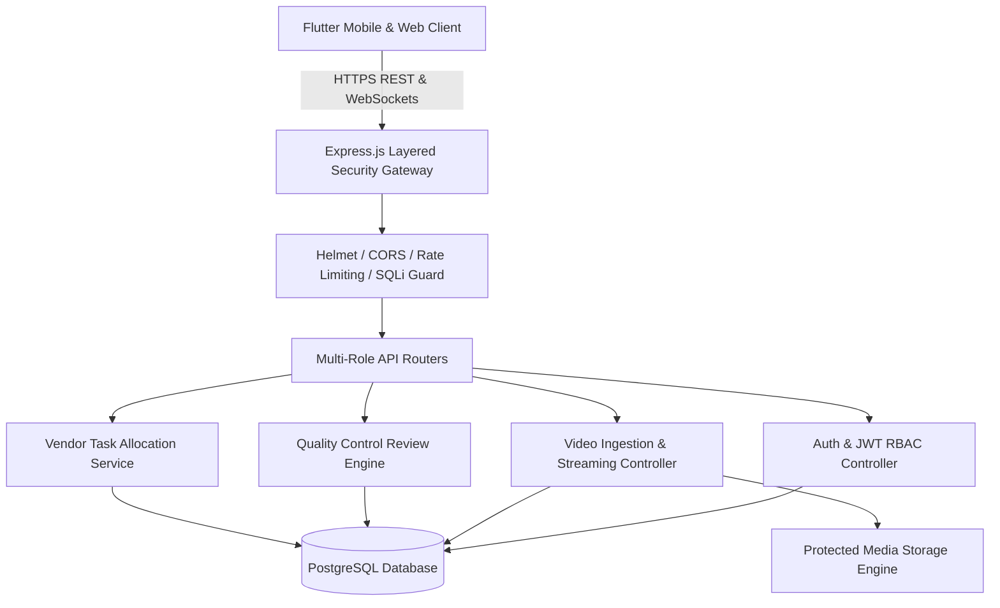

# Video Data Collection & Multi-Role Vendor Management Platform

A high-throughput, enterprise-grade video dataset collection, quality assurance (QC), and vendor operations platform. Designed for distributed multi-role workflows involving candidates, vendors, quality reviewers, and system administrators.

---

## 🔒 Intellectual Property & Proprietary Ownership Declaration

> [!IMPORTANT]
> **Proprietary and Confidential**  
> Copyright (c) 2026. All Rights Reserved.  
> This software codebase, architecture, and associated documentation are original, proprietary intellectual property.  
> - **100% Original Authorship**: Free from open-source obligations, client encumbrances, and third-party entanglements.  
> - **Non-Exclusive AI Model Licensing Compatible**: Designed to meet strict licensing criteria for machine learning training and benchmarking.

---

## 🏛️ System Architecture & Key Components



### Core Technology Stack:
- **Mobile & Web Application**: Flutter 3.x (Dart cross-platform web/mobile).
- **Backend API Server**: Node.js 18+ & Express.js.
- **Database**: PostgreSQL with connection pooling (`pg`).
- **Real-Time Communication**: Socket.io WebSockets.
- **Security & Integrity**: Helmet, Express Rate Limit, BCrypt, JWT, SQL Injection Sanitizer.
- **Automated Testing**: Jest, Supertest, Flutter Test.
- **Infrastructure & Orchestration**: Docker Compose, Terraform.

---

## 👥 Multi-Role Workflow Capabilities

| User Role | Core Capabilities |
| :--- | :--- |
| **Candidate** | View video collection assignments, record/upload high-resolution video streams, track submission approval status. |
| **Vendor** | Manage candidate pools, distribute collection quotas, monitor submission metrics and vendor payouts. |
| **QC Reviewer** | Frame-accurate video inspection, ticket generation, defect tagging, and approve/reject decision lifecycle. |
| **Admin** | System-wide analytics, user role provisioning, database migrations, and dataset export tooling. |

---

## 🚀 Quickstart & Installation

### Option 1: Docker 1-Click Launch (Recommended)
```bash
# Windows
.\docker-start.bat

# Linux / macOS
chmod +x docker-start.sh
./docker-start.sh

# Or via Docker Compose directly:
docker compose up --build -d
```

### Option 2: Manual Local Setup

#### 1. Configure Environment Variables
```bash
cp .env.example .env
cp backend/.env.example backend/.env
```

#### 2. Install & Start Backend API Server
```bash
cd backend
npm install
npm run dev
```
*Backend API Server will start on `http://localhost:5000/api/v1`.*

#### 3. Start Flutter Mobile & Web Client
```bash
cd mobile-app
flutter pub get
flutter run -d web-server --web-port 8081
```
*Web Application Portal will open on `http://localhost:8081`.*

---

## 🧪 Automated Testing & Runnability Verification

This codebase includes automated test suites covering API health, security middleware, authentication constraints, video upload workflows, and QC ticket state transitions:

```bash
# Run Backend Integration & Unit Test Suites (Jest)
npm test

# Or directly in the backend directory
cd backend
npm test

# Run Mobile & Model Serialization Tests (Flutter)
cd mobile-app
flutter test
```

---

## 📡 RESTful API Reference Summary

| Method | Endpoint | Description | Auth Required |
| :--- | :--- | :--- | :---: |
| `GET` | `/health` | Server health check & uptime probe | No |
| `POST` | `/api/v1/auth/register` | Register candidate or vendor user | No |
| `POST` | `/api/v1/auth/login` | Authenticate user & issue JWT token | No |
| `POST` | `/api/v1/videos/upload` | Multipart video file upload & validation | Yes (JWT) |
| `GET` | `/api/v1/videos/:id/stream` | Authenticated media streaming URL | Yes (JWT) |
| `POST` | `/api/v1/qc-tickets` | Create quality inspection review ticket | Yes (QC/Admin) |
| `GET` | `/api/v1/vendor/candidates` | List vendor-managed candidate pool | Yes (Vendor) |
| `GET` | `/api/v1/admin/analytics` | High-level platform telemetry metrics | Yes (Admin) |

---

## 📁 Repository Structure

```
video-platform/
├── backend/                  # Express.js REST API server & business logic
│   ├── src/                  # Application source code
│   │   ├── controllers/      # Route controllers (Auth, Video, QC, Vendor, Admin)
│   │   ├── middleware/       # Security, sanitization, rate limiting, JWT auth
│   │   ├── routes/           # REST endpoint routers
│   │   ├── services/         # Background workers, notifications, database pool
│   │   └── app.js            # Express application configuration
│   ├── tests/                # Automated Jest test suites (Health, Auth, Security, QC, Video)
│   └── package.json          # Node backend dependencies & test scripts
├── mobile-app/               # Flutter cross-platform mobile & web client
│   ├── lib/                  # Dart UI components, state management, API models
│   └── test/                 # Flutter widget & model serialization tests
├── database/                 # PostgreSQL migrations, schema DDL, seed data
├── docker/                   # Production Dockerfile & container orchestration
├── terraform/                # Cloud infrastructure provisioning templates
├── .env.example              # Sanitized environment configuration template
└── README.md                 # Master project documentation
```
